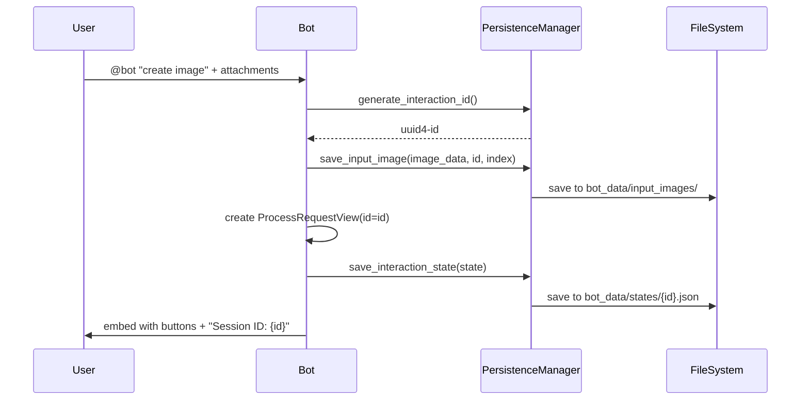
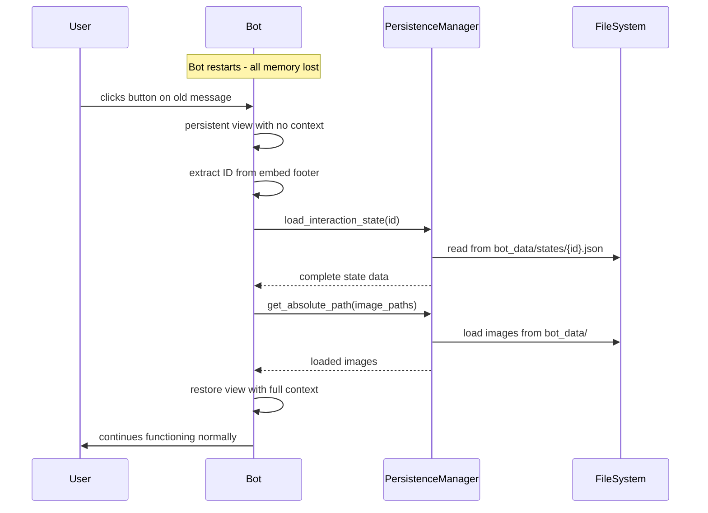

# Persistent Views Architecture

## Overview

The Nano Banana Discord Bot uses a **comprehensive persistence system** that eliminates timeout issues and provides **true persistence across bot restarts**. This system ensures that user interactions remain functional indefinitely and can restore full context after restarts.

## Key Improvements ✨

### Before (v1 - Basic Persistence)
- ❌ Views showed "Interaction Expired" after bot restart
- ❌ Lost all context and data after restart
- ❌ Input images not saved permanently
- ❌ Users had to start over completely

### After (v2 - True Persistence)
- ✅ **No more "Interaction Expired" messages**
- ✅ **Full context restoration** after restart
- ✅ **Input images saved permanently** with unique IDs
- ✅ **Complete interaction state** preserved
- ✅ **Seamless user experience** across restarts

## Architecture Components

### 1. Persistent Views (Enhanced)
- All View classes use `timeout=None` to prevent automatic timeouts
- All interactive components have stable `custom_id` for routing
- Views save and restore complete state automatically
- State restoration attempts on every interaction

### 2. Persistence Layer (New)
- **PersistenceManager**: Handles file storage and state management
- **JSON State Storage**: Complete interaction data in `bot_data/states/`
- **Image Storage**: Input/output images with ID-based organization
- **Automatic Cleanup**: Removes old interaction data

### 3. Enhanced Data Models
- **OutputItem**: Extended with `interaction_id` and persistence methods
- **PersistedInteractionState**: Complete serializable state representation
- **Unique IDs**: UUID4-based interaction identification

## Interaction Flow

### Initial Request


### Bot Restart + User Interaction


## Technical Implementation

### Custom IDs for Routing

**StyleOptionsView:**
- `style_nav_left` - Navigate to previous output
- `style_nav_right` - Navigate to next output  
- `style_process_prompt` - Process current image with prompt
- `style_edit_prompt` - Edit prompt for generated image
- `style_options_select` - Style dropdown selector

**ProcessRequestView:**
- `process_request_button` - Main process button
- `process_edit_prompt` - Edit prompt button
- `process_style_select` - Style template selector

### State Persistence

Each interaction saves:
```json
{
  "interaction_id": "123e4567-e89b-12d3-a456-426614174000",
  "interaction_type": "style_view",
  "created_at": "2024-08-31T12:00:00",
  "original_text": "User's original prompt",
  "original_image_paths": [
    "input_images/input_123e4567_0_20240831_120000.png"
  ],
  "outputs": [
    {
      "image_path": "output_images/output_123e4567_generated_20240831_120030.png",
      "filename": "generated_20240831_120030.png",
      "prompt_used": "Enhanced prompt with style",
      "timestamp": "20240831_120030"
    }
  ],
  "current_index": 0,
  "user_id": 12345,
  "channel_id": 67890,
  "message_id": 98765
}
```

### Safe Interaction Handling

Enhanced `safe_interaction_response()` helper:
- Handles interaction token expiry gracefully
- Falls back to direct message editing when tokens expire
- Provides robust error handling for various interaction states
- Works seamlessly with persistence restoration

## Benefits

### For Users
1. **No Timeouts**: Unlimited time to interact with bot messages
2. **Restart Resilience**: Interactions work even after bot restarts
3. **Better UX**: No more "This interaction failed" messages
4. **Persistent History**: Can return to old generations anytime

### For Developers
1. **Reliable State**: Complete interaction context preserved
2. **Debugging**: Interaction IDs in embeds for tracing
3. **Maintenance**: Automatic cleanup of old data
4. **Monitoring**: Comprehensive logging of persistence operations

## Deployment Considerations

### Storage Requirements
- **States**: ~1-5KB per interaction (JSON files)
- **Images**: ~1-10MB per interaction (PNG files)
- **Cleanup**: Configurable retention period (default: 30 days)

### Performance
- **Startup**: Views registered asynchronously
- **Runtime**: Minimal overhead for active interactions
- **Storage**: Background cleanup prevents unbounded growth

### Monitoring
```bash
# Check persistence system status
ls -la bot_data/states/ | wc -l  # Number of active interactions
du -sh bot_data/               # Total storage usage
grep "persistence" bot.log     # Persistence operations
```

## Troubleshooting

### Common Scenarios

**User clicks button on very old message**
- System attempts restoration from interaction ID
- If state missing: Shows "could not be restored" message
- User creates new request seamlessly

**Bot restart during active generation**
- In-progress generations are lost (expected)
- Completed generations remain accessible
- User can retry failed generations

**Storage full or corrupted**
- System logs errors but continues operating
- Graceful fallback to "create new request" flow
- No bot crashes or service interruption

## Future Enhancements

1. **Database Backend**: Replace JSON with SQLite/PostgreSQL
2. **Cloud Storage**: Support for distributed deployments
3. **User Preferences**: Persistent user settings and preferences
4. **Analytics**: Usage patterns and interaction metrics
5. **Backup/Restore**: Tools for data management

## Migration Guide

The enhanced persistence system is fully backward compatible:

1. **Existing Views**: Continue working with improved error messages
2. **Old Interactions**: Show helpful "create new request" instead of generic errors
3. **New Interactions**: Gain full persistence automatically
4. **No Downtime**: Can be deployed without service interruption

This architecture ensures the bot provides a smooth, reliable experience regardless of restarts or infrastructure changes.